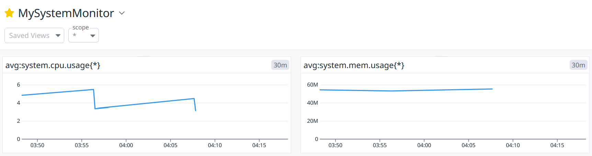

# Datadog Monitoring Script
Monitors CPU/memory, sends metrics to Datadog via DogStatsD, alerts on thresholds. Simulates e-commerce app monitoring for IT operations.

## Setup
- Install: `pip install psutil datadog`
- Install Datadog Agent (Windows v7)
- Add Datadog API/app keys
- Run: `python monitor.py`

## Purpose
Demonstrates proactive monitoring, alerting, and Datadog integration.

## Screenshots

## Job Relevance
Aligns with IT operations monitoring, outage detection, and Datadog needs.
